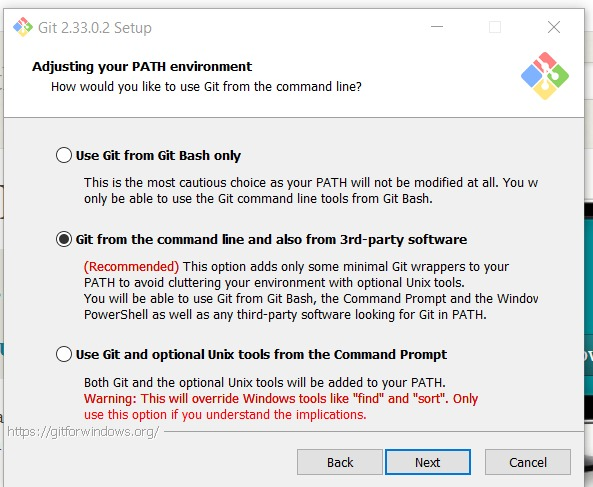

# Laporan Instalasi git

Git adalah salah satu sistem pengontrol versi (Version Control System) pada proyek perangkat lunak yang diciptakan oleh Linus Torvalds.
Pengontrol versi bertugas mencatat setiap perubahan pada file proyek yang dikerjakan oleh banyak orang maupun sendiri.

Installer git dapat di download di halaman [download git](https://git-scm.com/downloads).

Versi git yang akan saya install disini adalah versi 2.33.0.2.
Karena saya menggunakan windows jadi saya menggunakan installer untuk windows.

---

Selanjutnya dibutuhkan teks editor seperti [Sublime Text](https://www.sublimetext.com/), [Notepad++](https://notepad-plus-plus.org/downloads/), atau [Visual Studio Code](https://code.visualstudio.com/download) untuk bisa menginstall git.

---

1. Jika sudah memiliki teks editor, klik dua kali pada file installer git yang sudah di download.
Maka akan muncul jendela lisensi seperti ini. Klik tombol **Next** untuk melanjutkan.                                  

1. Selanjutnya pilih lokasi dimana Git akan diinstall. Saya membiarkannya secara default yaitu di C:\Program files\Git.

3. Untuk komponen yang akan diinstall saya membiarkannya secara default.         

4. Setalah itu memilih folder untuk shortcut start menu. Disini saya juga membiarkannya secara default yaitu pada folder **Git**.

5. Selanjutnya adalah memilih teks editor yang akan digunakan oleh git. Disini saya menggunakan [Visual Studio Code](https://code.visualstudio.com/download).

6. Setelah itu adalah mengatur nama branch utama ketika membuat repository baru. Pilihan pertama adalah pilihan default dengan branch utama dinamakan **master**. Pilihan kedua adalah untuk memberi nama secara custom seperti **main**, **utama**, dll. Disini saya memilih pilihan pertama.

7. Selanjutnya adalah mengatur PATH environtment untuk git. Saya memilih pilihan kedua agar git dapat digunakan melalui git bash ataupun command prompt pada windows.                                      

8. Lalu memilih SSH yang akan digunakan oleh git. Secure shell atau SSH adalah protokol transfer yang memungkinkan penggunanya untuk mengontrol sebuah perangkat secara remote atau dari jarak jauh melalui koneksi internet. Saya memilih pilihan pertama untuk menggunakan SSH yang sudah disediakan git.                                                           

9. Selanjutnya saya memilih SSL untuk HTTPS. Git dapat menggunakan HTTPS atau SSH untuk mengakses repository pada github.

10. Saya memilih pilihan pertama untuk akhir baris teks (CR-LF).            

11. Setelah itu saya memilih MinTTY untuk terminal yang digunakan untuk mengakses git bash.

12. Untuk git pull saya memilih pilihan default(fast-forward atau merge). Git pull berfungsi untuk mengambil/mengupdate commit terbaru
dari repository remote ke repository lokal.                                                  

13. Selanjutnya saya memilih pilihan pertama yaitu git credential manager core agar bisa digunakan di berbagai platform.

14. Untuk pengaturan tambahan pilih pilihan pertama yaitu enable file system caching.

15. Setelah itu saya mengosongkan pengaturan experimental dan langsung mulai menginstall.

16. Selanjutnya instalasi akan berlangsung.             

17. Setelah selesai klik finish dan git sudah terinstall.  

18. Jika git sudah terinstall ketikkan `<git --version>` pada command prompt. Jika muncul versi git maka git sudah berhasil diinstall.
