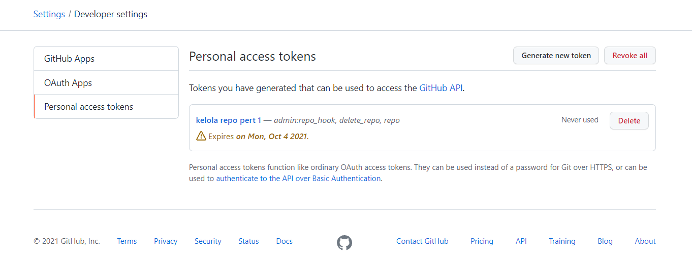
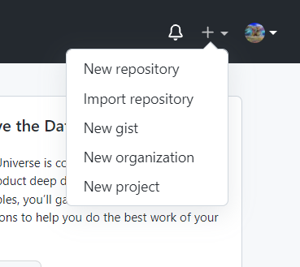
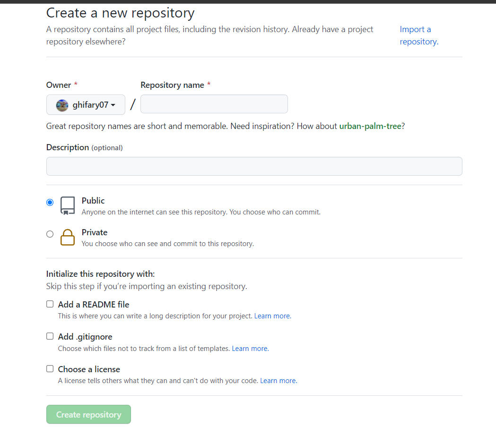
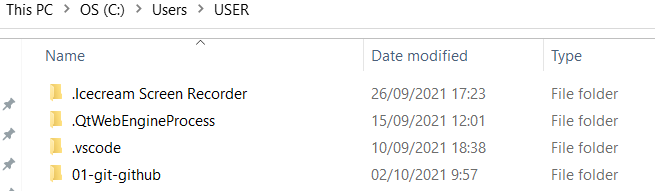
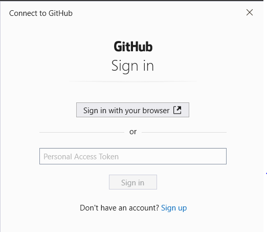
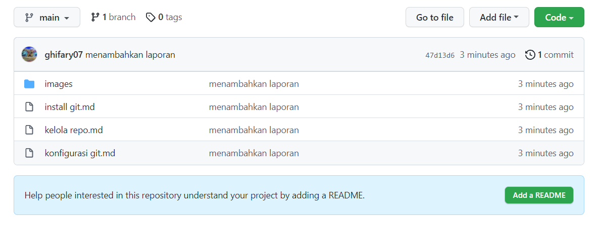
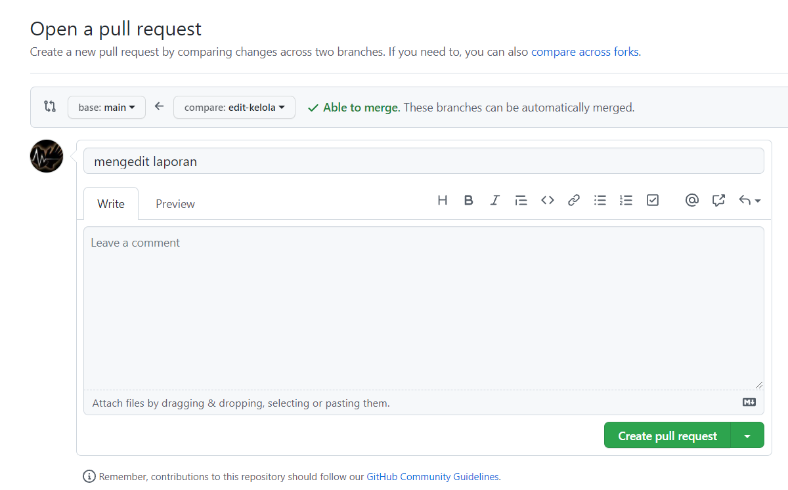
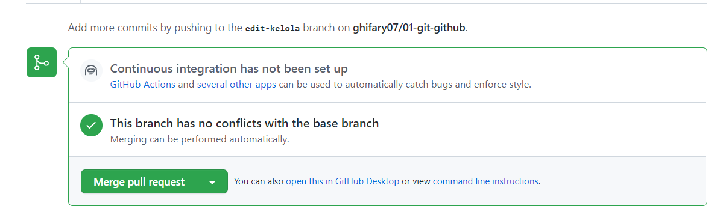

# Laporan mengelola git

## Personal Access Token

Sebelum mengelola repository, hal pertama yang harus dilakukan adalah membuat personal access token.
Karena proses mengelola repo ini memerlukan akses repo dari command line / shell, sehingga wajib menggunakan token.
Setelah membuat personal akses token mengikuti [petunjuk](https://docs.github.com/en/authentication/keeping-your-account-and-data-secure/creating-a-personal-access-token), hasilnya adalah:


## Membuat Repository

1. Klik tanda + pada bagian kanan atas setelah login ke github, lalu pilih new repository.                      


2. Isi nama repository, deskripsi, pengaturan publik atau private, lisensi, dan tambahan lainnya. Setelah itu klik create repository.


## Clone Repository

Selanjutnya adalah clone repository ke komputer lokal agar lebih mudah dikelola. Clone repository dilakukan dengan perintah:

```
$ git clone https://github.com/ghifary07/01-git-github
```

Setelah itu akan ada folder baru dengan nama repository tersebut di tempat dimana perintah itu diketikkan.


Jika repo sudah di clone selanjutnya adalah mmengubah nama branch utama.
Nama branch utama di pengaturan default git adalah master.
Untuk mengubahnya menjadi main bisa digunakan:

```
$ cd 01-git-github
$ git branch -m main
```

## Mengubah isi git - Push

Untuk menambahkan file yang sudah dibuat dari folder repository lokal ke repository remote/online dapat dilakukan push.
Push dilakukan jika terdapat perubahan seperti membuat file, menghapus file, mengedit file, dan membuat direktori baru.
Push dapat dilakukan di direktori repo lokal dengan perintah:

```
$ git add . 
$ git commit -m "first commit" 
$ git push origin main
```
1. git add “.” atau nama file
untuk menambah file project yang akan di upload sebelum di commit, tanda titik setelah kata “add” pada perintah tersebut artinya semua file yang ada di folder akan diupload ke repository online. Perintah ini dapat digunakan ketika menambahkan file pertama kali. 

1. git commit -m “isi commit”
untuk menambah keterangan/status perubahaan saat upload ke repo online, keterangan ditulis setelah “git commit -m” ditambah tanda petik lalu komentar.

3. git push origin “nama branch”
Perintah untuk mengupload file yang ada pada repo lokal ke repo online yang diletakkan pada branch yang sudah tersedia di repo online.

Hasilnya adalah:

```
Microsoft Windows [Version 10.0.19041.208]
(c) 2020 Microsoft Corporation. All rights reserved.

C:\Users\USER>cd 01-git-github

C:\Users\USER\01-git-github>git status
On branch main

No commits yet

Untracked files:
  (use "git add <file>..." to include in what will be committed)
        images/
        install git.md
        kelola repo.md
        konfigurasi git.md

nothing added to commit but untracked files present (use "git add" to track)

C:\Users\USER\01-git-github>git add .

C:\Users\USER\01-git-github>git commit -m "menambahkan laporan"
[main (root-commit) 47d13d6] menambahkan laporan
 27 files changed, 147 insertions(+)
 create mode 100644 images/01/git1.jpeg
 create mode 100644 images/01/git10.jpeg
 create mode 100644 images/01/git11.jpeg
 create mode 100644 images/01/git12.jpeg
 create mode 100644 images/01/git13.jpeg
 create mode 100644 images/01/git14.jpeg
 create mode 100644 images/01/git15.jpeg
 create mode 100644 images/01/git16.jpeg
 create mode 100644 images/01/git17.jpeg
 create mode 100644 images/01/git18.jpeg
 create mode 100644 images/01/git19.PNG
 create mode 100644 images/01/git2.jpeg
 create mode 100644 images/01/git3.jpeg
 create mode 100644 images/01/git4.jpeg
 create mode 100644 images/01/git5.jpeg
 create mode 100644 images/01/git6.jpeg
 create mode 100644 images/01/git7.jpeg
 create mode 100644 images/01/git8.jpeg
 create mode 100644 images/01/git9.jpeg
 create mode 100644 images/02/config.PNG
 create mode 100644 images/03/auth.PNG
 create mode 100644 images/03/repo1.PNG
 create mode 100644 images/03/repo2.PNG
 create mode 100644 images/03/repo3.PNG
 create mode 100644 install git.md
 create mode 100644 kelola repo.md
 create mode 100644 konfigurasi git.md

C:\Users\USER\01-git-github>git push origin main
Enumerating objects: 33, done.
Counting objects: 100% (33/33), done.
Delta compression using up to 16 threads
Compressing objects: 100% (32/32), done.
Writing objects: 100% (33/33), 1.12 MiB | 1.69 MiB/s, done.
Total 33 (delta 0), reused 0 (delta 0), pack-reused 0
To https://github.com/ghifary07/01-git-github
 * [new branch]      main -> main
 ```

Saat melakukan push akan diminta personal access token. Masukkan personal access token yang sebelumnya dibuat.



Setelah itu refresh halaman repository di github dan file sudah berhasil ditambahkan.


## Mengubah isi git - Push(Branching dan Merging)

Cara ini dilakukan dengan cara membuat branch baru lalu menampung perubahan file pada branch baru tersebut. Setelah itu, branch yang baru dibuat tadi akan dibandingkan dengan branch utama lalu di merge atau digabung untuk memindahkan perubahan tadi ke branch utama.

```
C:\Users\USER\Documents\GitHub\01-git-github>git checkout -b edit-kelola
Switched to a new branch 'edit-kelola'

C:\Users\USER\Documents\GitHub\01-git-github>git status
On branch edit-kelola
Changes not staged for commit:
  (use "git add <file>..." to update what will be committed)
  (use "git restore <file>..." to discard changes in working directory)
        modified:   kelola repo.md

no changes added to commit (use "git add" and/or "git commit -a")
C:\Users\USER\Documents\GitHub\01-git-github>git add "kelola repo.md"

C:\Users\USER\Documents\GitHub\01-git-github>git commit -m "mengedit laporan"
[edit-kelola 4a57e52] mengedit laporan
 1 file changed, 7 insertions(+), 2 deletions(-)

C:\Users\USER\Documents\GitHub\01-git-github>git checkout main
Switched to branch 'main'
Your branch is up to date with 'origin/main'.

C:\Users\USER\Documents\GitHub\01-git-github>git status
On branch main
Your branch is up to date with 'origin/main'.

nothing to commit, working tree clean

C:\Users\USER\Documents\GitHub\01-git-github>git push origin edit-kelola
Enumerating objects: 5, done.
Counting objects: 100% (5/5), done.
Delta compression using up to 16 threads
Compressing objects: 100% (3/3), done.
Writing objects: 100% (3/3), 507 bytes | 253.00 KiB/s, done.
Total 3 (delta 2), reused 0 (delta 0), pack-reused 0
remote: Resolving deltas: 100% (2/2), completed with 2 local objects.
remote:
remote: Create a pull request for 'edit-kelola' on GitHub by visiting:
remote:      https://github.com/ghifary07/01-git-github/pull/new/edit-kelola
remote:
To https://github.com/ghifary07/01-git-github.git
 * [new branch]      edit-kelola -> edit-kelola
 ```

`<git checkout nama branch>` digunakan untuk berpindah branch. Jika terdapat -b sebelum nama branch maka akan dibuat branch baru dengan nama branch tersebut.                                                                                                       


Setelah itu buat pull request di github lalu compare dan merge branch.




Selanjutnya adalah merge di komputer lokal dan menghapus branch yang dibuat tadi.                                                

```
C:\Users\USER\Documents\GitHub\01-git-github>git merge edit-kelola
Updating 2ea0ab3..4a57e52
Fast-forward
 kelola repo.md | 9 +++++++--
 1 file changed, 7 insertions(+), 2 deletions(-)

C:\Users\USER\Documents\GitHub\01-git-github>git branch -D edit-kelola
Deleted branch edit-kelola (was 4a57e52).

C:\Users\USER\Documents\GitHub\01-git-github>git branch
* main

C:\Users\USER\Documents\GitHub\01-git-github>git pull
remote: Enumerating objects: 1, done.
remote: Counting objects: 100% (1/1), done.
remote: Total 1 (delta 0), reused 0 (delta 0), pack-reused 0
Unpacking objects: 100% (1/1), 641 bytes | 160.00 KiB/s, done.
From https://github.com/ghifary07/01-git-github
   2ea0ab3..c965357  main       -> origin/main
Updating 4a57e52..c965357
Fast-forward
```