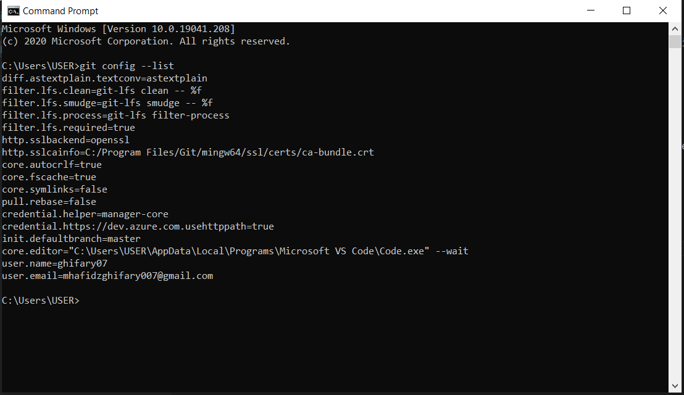

# Laporan konfigurasi git

Selanjutnya adalah mengkonfigurasi git dengan email dan username yang sudah didaftarkan di [github](https://github.com/).
Username dan email ini nanti akan dimasukkan oleh Git ke catatan perubahan di repository bila terjadi perubahan pada repository git.

```
$ git config --global user.name "Username di GitHub"
$ git config --global user.email email@domain.tld
```
Setelah sudah mengkonfigurasi dengan perintah di atas selanjutnya adalah mengecek apakah konfigurasi sudah ada dengan perintah:

```
$ git config --list
```

Hasilnya adalah:
